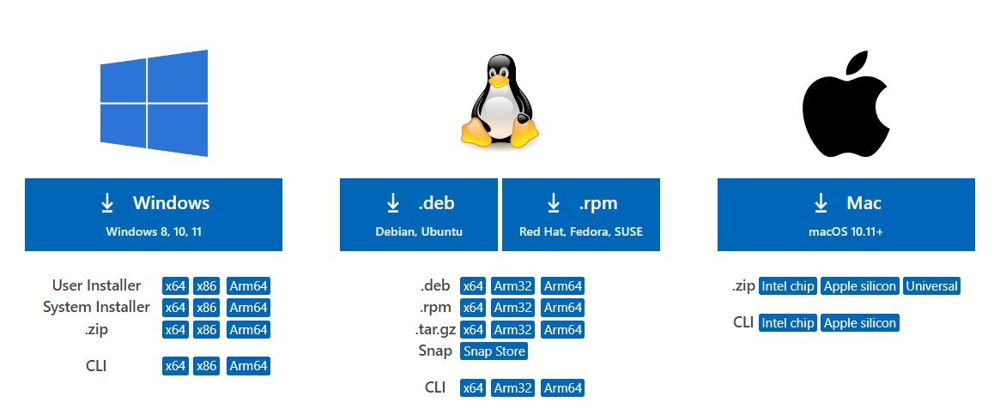
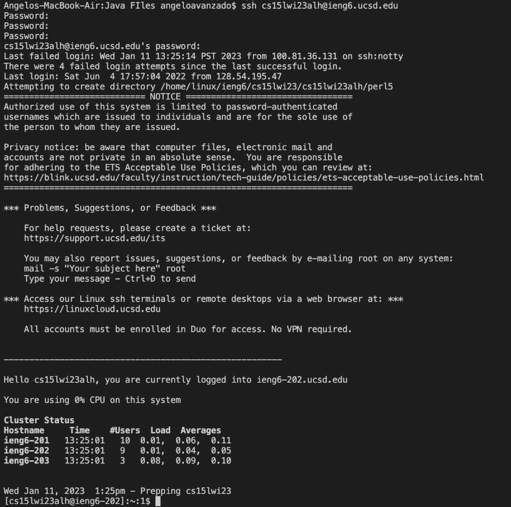
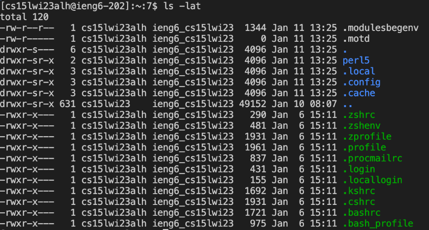

# Week 1 Lab Report

The following is a tutorial about how to log into a course-specific account on "ieng6"

# 1. Installing VScode
* Firstly, visit the [Visual Studio Code website](https://code.visualstudio.com/download) for the download links
* Then download Visual Studio Code on based on whatever device you are using (OSX for Macs, Windows for PCs, etc)

* Lastly, open VScode, making sure that it works on your device

# 2. Remotely Connecting
* If you are using a mac, there is nothing more you need to install
* Open the terminal on your device (Ctrl or Command + \` ) and enter `ssh ###***@ieng6.ucsd.edu `
  where ### is the name of your class and quarter (e.g. cs15lwi23) and *** replaced with the letters unique to your course account
* If this is your first time logging in then you will be asked if you want to continue connecting to which you will enter "yes", followed by entering your password for the account

# 3. Trying Some Commands
* Test out some simple commands such as `pwd`, `cd`, `ls`, `mkdir`, and `cp`
  * `pwd` - stands for "prints working directory" and displays the current working directory
  * `cd` - stands for "change directory" and changes the current working directory to the inputted path
  * `ls` - stands for "list" and displays a list of files and folders from the inputted path
  * `mkdir` - stands for "make directory" and creates a new directory
  * `cp` - stands for "copy" and copies files
* Your class directory will typically be `/home/linux/ieng6/***` where *** is the name of your class and quarter (e.g. cs15lwi23)
* Example of a command using `ls`

* In order to exit the terminal use either Ctrl + D or run the command `exit` 
