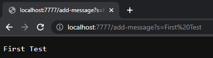
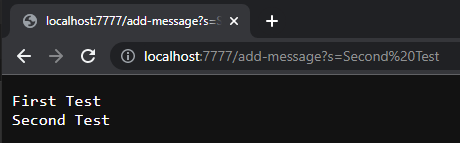
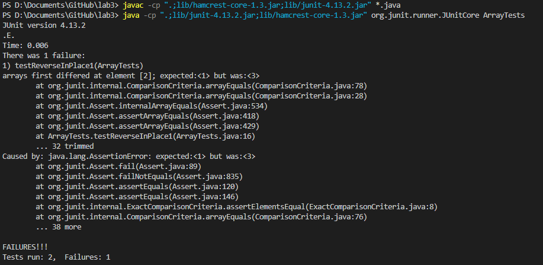

# Part 1
StringServer Code:
```
import java.io.IOException;
import java.net.URI;

class Handler implements URLHandler {
    String fullString = "";

    public String handleRequest(URI url) {
        if (url.getPath().contains("/add-message")) {
            String[] parameters = url.getQuery().split("=");
            if (parameters[0].equals("s")) {
                fullString += (parameters[1] + "\n");
                return fullString;
            }
            return "Invalid URL for adding message!";
        }
        else{
            return "404 Not Found!";
        }
    }         
}

class StringServer  {
    public static void main(String[] args) throws IOException {
        if(args.length == 0){
            System.out.println("Missing port number! Try any number between 1024 to 49151");
            return;
        }

        int port = Integer.parseInt(args[0]);

        Server.start(port, new Handler());
    }
}
```

 * Both the `main()` method and `handleRequest` method are called.
 * For `main()` the relevent argument is `String[] args` as `args[0]` which equals `7777` contains the port number of the webserver.
 * For `handleRequest()` the relevent arguement to this method is `URI url` which is `"http://localhost:7777/add-message?s=First%20Test"`, the entire url of the webserver.
 * As for relevent fields of the class `String fullString` which is now `"First Test" + \n`, the string printed to the webserver. Another field is `String[] parameters` as `parameters[1]` contains the string `"First Test"` which was inputted within the url as part of the query.
 * The `String fullString` field changes from an empty string to `"First Test" + \n` 


 * Similar to the first usage of `/add-message`, both the `main()` method and `handleRequest` method are called.
 * For `main()` the relevent argument is `String[] args` as `args[0]` which equals `7777` contains the port number of the webserver.
 * For `handleRequest()` the relevent arguement to this method is `URI url` which is `"http://localhost:7777/add-message?s=Second%20Test"`, the entire url of the webserver.
 * As for relevent fields of the class `String fullString` which is now `"First Test" + \n + "Second Test" + \n`, the string printed to the webserver. Another field is `String[] parameters` as `parameters[1]` contains the string `"Second Test"` which was inputted within the url as part of the query.
 * The `String fullString` field changes from `"First Test" + \n` to `"First Test" + \n + "Second Test" + \n`.

# Part 2
## reverseInPlace() Method Bugs
 * Failure inducing input as a JUnit test
```
public void testReverseInPlace1(){
    int[] input1 = {1,2,3};
    ArrayExamples.reverseInPlace(input1);
    assertArrayEquals(new int[]{3,2,1}, input1);
}
```
## An input that doesn't induce a failure as a JUnit test
```
public void testReverseInPlace1(){
    int[] input1 = {1,1,1};
    ArrayExamples.reverseInPlace(input1);
    assertArrayEquals(new int[]{1,1,1}, input1);
}
```
## The symptom, as the output of running the tests
 
## The bug
## Before
```
static void reverseInPlace(int[] arr) {
    for(int i = 0; i < arr.length; i += 1) {
        arr[i] = arr[arr.length - i - 1];
    }
}
```
## After
```
static void reverseInPlace(int[] arr) {
    for(int i = 0; i < arr.length / 2; i += 1) { //changed to iterate through half the array
        //implemented proper swapping functionality
        int temp = arr[i];
        arr[i] = arr[arr.length - i - 1];
        arr[arr.length - i - 1] = temp;
    }
}
```
## Why the fix addresses the issue
One issue in the initial reverseInPlace() function was that it was replacing the value at an index with the value at another index without properly swaping the two values at the two indices. In turn, the value at `arr[i]` would be overwritten and not assigned to the other index. The fix addresses this issue by utilizing a temporary integer variable in order to properaly swap the values at the two indices. Another issue is with how the function iterates through the array given the swaping nature of the indices. The fix addreses this issue as rather than iterating through the entire array, iterating through half the array instead would end the swaps at the correct index in order to properly reverse the array without incorrectly reswapping the array.

# Part 3
Something that I learned in week 2 was the idea of webservers and specifically how they utilize URLs in order to recieve input. While I had a general idea that URLs consisted of a path through a webpage, I didn't know that it was possible to use the URL itself within a program. Working with webservers has also helped my understanding of different components of a URL, such as the query, as I would sometimes look at the `?` in some URLs when I looked something up and now I understand what it is associated with.
