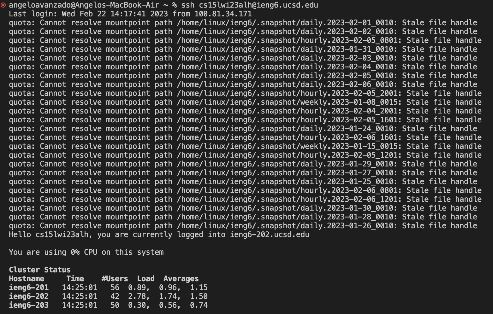
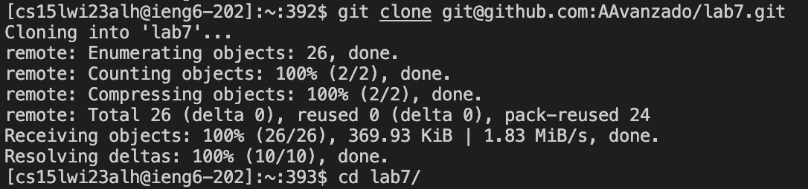
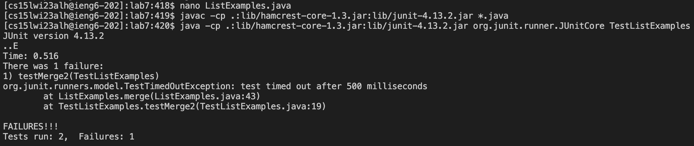
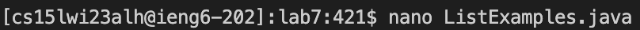
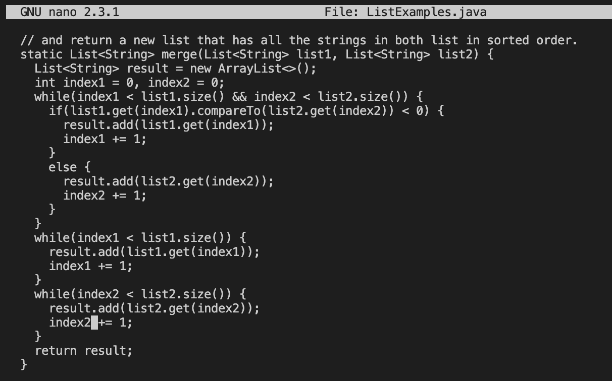
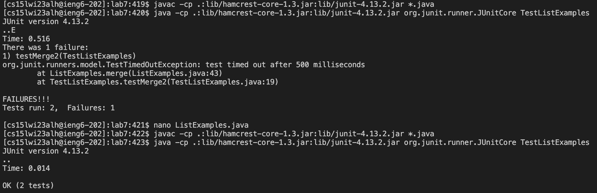
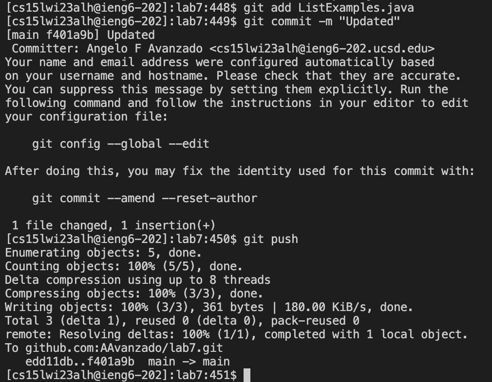

# Lab Report 4

## Log into ieng6

Keys pressed: `<up>`

## Clone your fork of the repository from your Github account

Keys pressed: `<up>`(x11), `<enter>`, `cd l<tab><enter>`

## Run the tests, demonstrating that they fail

Keys pressed: `<up>`(x8) `<enter>`, `<up>`(x8) `<enter>`

## Edit the code file to fix the failing test

Keys pressed: `<up>`(x8), `*touch pad to scroll to line*`, `<right>`(x12), `<backspace> 2`, `<Ctrl+O><enter><Ctrl+X>`

## Run the tests, demonstrating that they now succeed

Keys pressed: `<up>`(x3) `<enter>`, `<up>`(x3) `<enter>`

## Commit and push the resulting change to your Github account

Keys pressed: `git add L<tab>j<tab><enter>`, `git commit -m "Updated" <enter>`, `git push <enter>`
