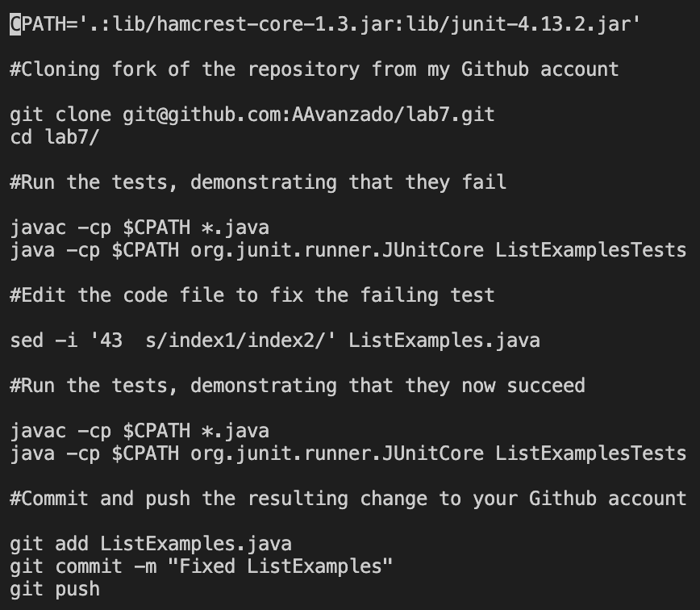
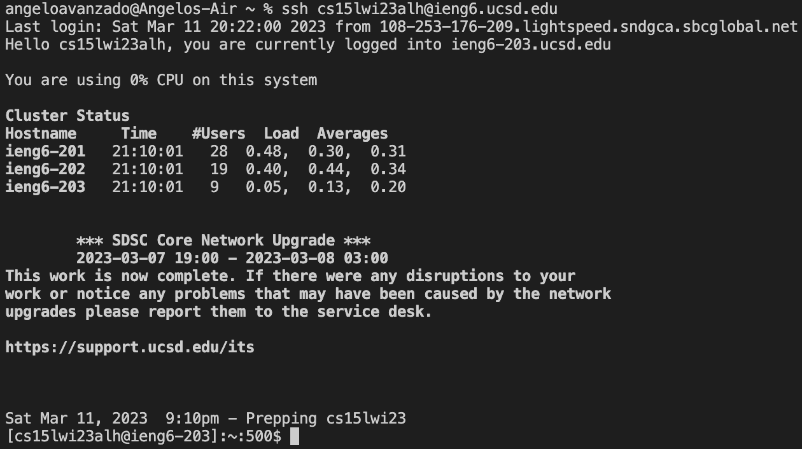
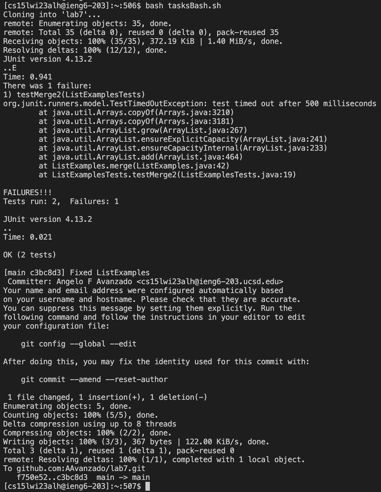

# Lab Report 5
---
# Revisiting Lab Report 4 (doing commands quickly)

## Lap Report 4 Recap
In Lab Report 4 we were tasked with recalling the specific steps that we took in order to complete a series of challenge tasks which were as follows:

1. Log into ieng6
2. Clone your fork of the repository from your Github account
3. Run the tests, demonstarting that they fail
4. Edit the code file to fix the failing test
5. Run the tests, demonstrating that they now succeed
6. Commit and push the resulting change to your Github account 

## Utilizing a Bash Script
Here, a bash script can be utilized in order to remove the requirement of having to input each command separately. Instead, this bash script enables us to run all of these commands immediately one after the other.

In my utilization of the bash script, there was only one command that was not part of it, and that was the step involving logging in to ieng6. This was because the bash script that I created was one of the files in the ieng6 server and thus in order to run the script, I first needed to log into the server to have access to it and subsequently run it.

Here is the bash script that I created:

Steps 2,3,5, and 6 are all the exact same commands that were initially run when doing Lab Report 4. The only difference that was introduced was the utilization of the `CPATH` variable that held the paths necessary to run the tests (steps 3 and 5).

Step 4 was the one command that was significantly different than how I executed it in Lab Report 4. In that prior lab report, I had used the `nano` command in order to view and edit `ListExamples.java`. Once inside the flie, I would manually go to the line that I needed to change, changing `index1` to `index2` on line 43.

Using the nano command within the bash script was no longer an option for me as it would require additional input on my end which would defeat the purpose of using the script in the first place. I went online to search for an alternative command that would allow me to edit a given line in the file without additional input. This search led me to the `sed` command.

## `sed` Command Details
Full `sed` command: `sed -i '43 s/index1/index2/' ListExamples.java`

As previously mentioned, the `sed` command allowed me to edit the `ListExamples.java` file without needing to provide any additional input. 

* In order to do an inline edit and edit the file directly I used the `-i` option. 
* The `43` at the beginning of the command represents the line where the substitution is to take place.
* The `s` represents the "substitution" operation. 
* The `/`s throughout serve as delimiters. 
* The first input after, which is in this case `index1`, is the string to be replaced.
* The second input, `index2`, is the string that will replace the old string. 
  * In this case, I could have simply had `1` to be replaced with `2` which would result in the same outcome, but decided to use `index1` and `index2` in order to more clearly indicate my intention with the command to others. 
* Finally, the `ListExamples.java` at the end indicates the file in which to make these changes.

## Full Execution

Logging into ieng6

Running the Bash Script

